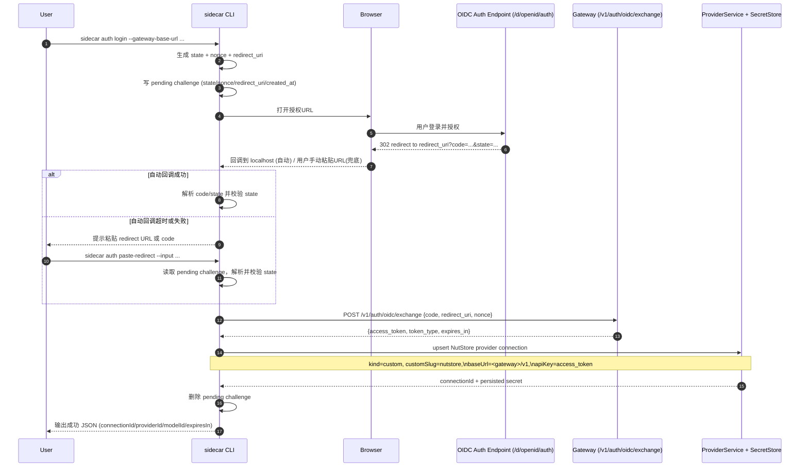

```mermaid
sequenceDiagram
    autonumber
    participant U as User
    participant C as sidecar CLI
    participant B as Browser
    participant A as OIDC Auth Endpoint (/d/openid/auth)
    participant G as Gateway (/v1/auth/oidc/exchange)
    participant P as ProviderService + SecretStore

    U->>C: sidecar auth login --gateway-base-url ...
    C->>C: 生成 state + nonce + redirect_uri
    C->>C: 写 pending challenge (state/nonce/redirect_uri/created_at)
    C->>B: 打开授权URL
    B->>A: 用户登录并授权
    A-->>B: 302 redirect to redirect_uri?code=...&state=...
    B-->>C: 回调到 localhost (自动) / 用户手动粘贴URL(兜底)

    alt 自动回调成功
        C->>C: 解析 code/state 并校验 state
    else 自动回调超时或失败
        C-->>U: 提示粘贴 redirect URL 或 code
        U->>C: sidecar auth paste-redirect --input ...
        C->>C: 读取 pending challenge，解析并校验 state
    end

    C->>G: POST /v1/auth/oidc/exchange {code, redirect_uri, nonce}
    G-->>C: {access_token, token_type, expires_in}

    C->>P: upsert NutStore provider connection
    Note over C,P: kind=custom, customSlug=nutstore,\nbaseUrl=<gateway>/v1,\napiKey=access_token
    P-->>C: connectionId + persisted secret

    C->>C: 删除 pending challenge
    C-->>U: 输出成功 JSON (connectionId/providerId/modelId/expiresIn)
```